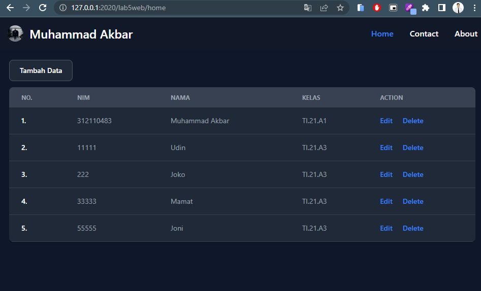
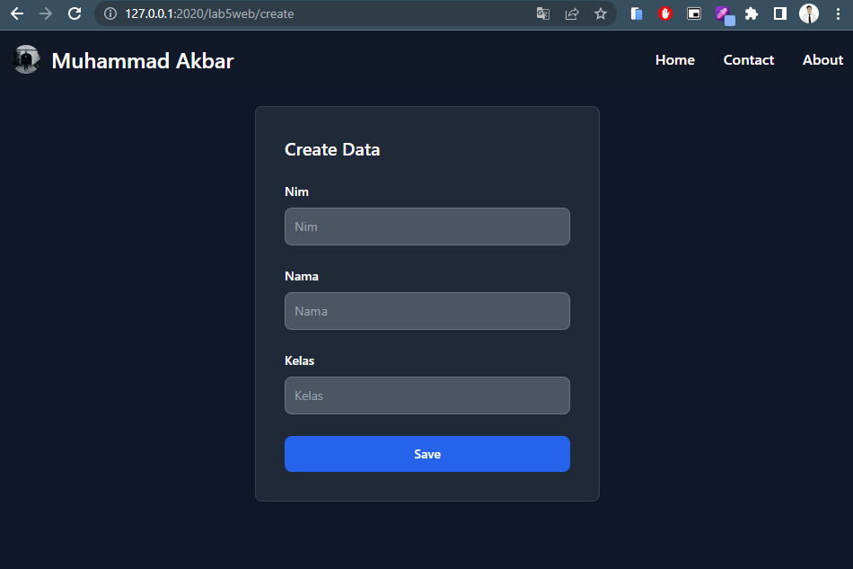
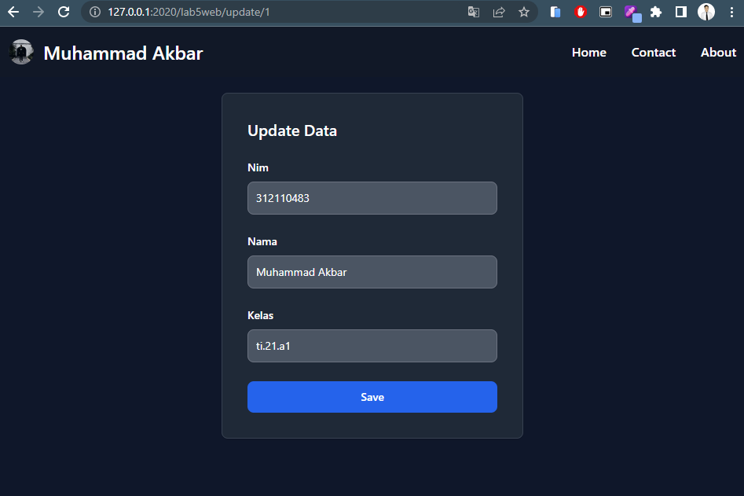
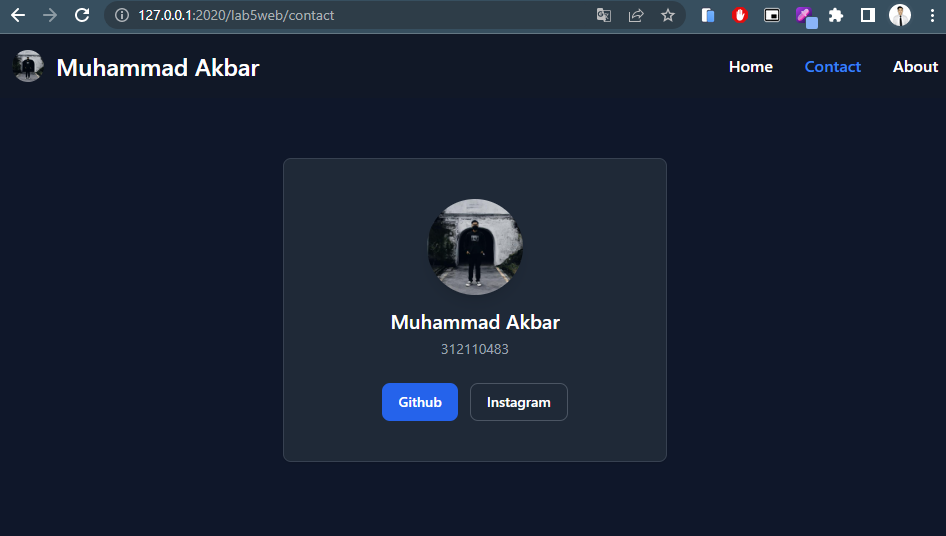
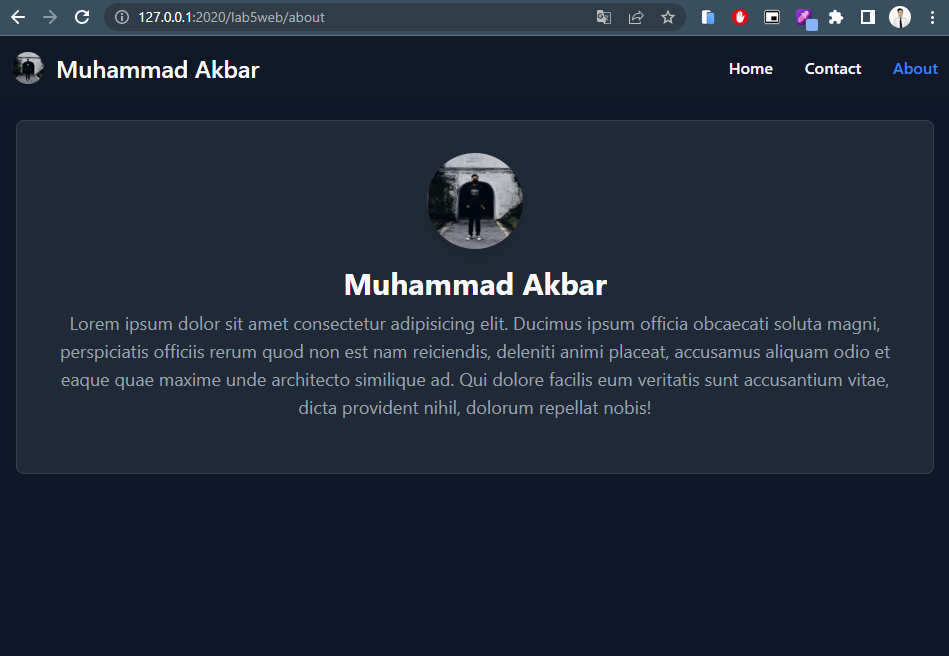

# PROJECT PRAKTIKUM 5 (PHP OOP)

**_Nama: Muhammad Akbar_** <br/>
**_Nim : 312110483_** <br/>
**_Kelas : TI.21.A3_** <br/>

<br/><br/>

## **Home**


<br/>

## **Create**


<br/>

## **Update**


<br/>

## **Contact**


<br/>

## **About**


<br/>

## **Directory Tree**
```bash
Lab3Web
│   ├──.htaccess
│   ├──index.php
│   ├──lab5web.sql
│   ├──README.md
│   └──route.php
│   
├───includes
│    ├──form_insert.php
│    └──form_update.php
│       
├───requires
│    ├──config.php
│    ├──database.php
│    └──form.php
│       
├───screenshot
│    ├──About.png
│    ├──Contact.png
│    ├──Create.png
│    ├──Home.png
│    └──Update.png
│       
└───views
     ├──about.php
     ├──contact.php
     ├──create.php
     ├──delete.php
     ├──error.php
     ├──home.php
     └──update.php
```
